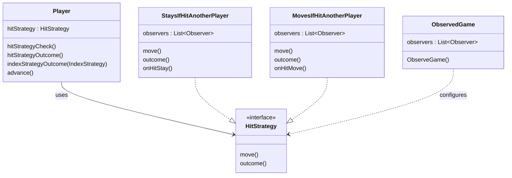

Clean architecture introduces the idea of splitting what we called the application code into a Domain Model and Use Cases.
We will define the Domain Model as being the Entities, Value Objects and Domain Services that model the business domain (problem).

A Game is an Entities (have an identity, we save and retrieve a Game)
Dice Rolls are Value Objects (just a value)
Rest of the code will be stateful or stateless Services (Hit rules for example) and other stateful objects that belong to the Game

To implement the functional variations, the strategy pattern was used for the win and hit conditions. The algorithm on the next decision if a player is hit or overshoots the end is the thing that is varying. Hence it is extracted from the main game code, and each different outcome is encapsulated in its own class with a common interface. For the “DoesNotNeedToLandOnEndToWin” condition, if a player overshoots the message is sent to the console and their current index is set end of tail to satisfy that the player is at the end for the game to end. For the “NeedToLandOnEndToWin” condition, the current index is set back to before the roll was added if the player overshoots. Then in the main game, the position will be the same as the start with the message output there to say the player overshoots but stays in the same place. 

