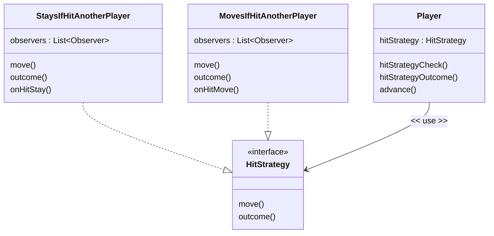
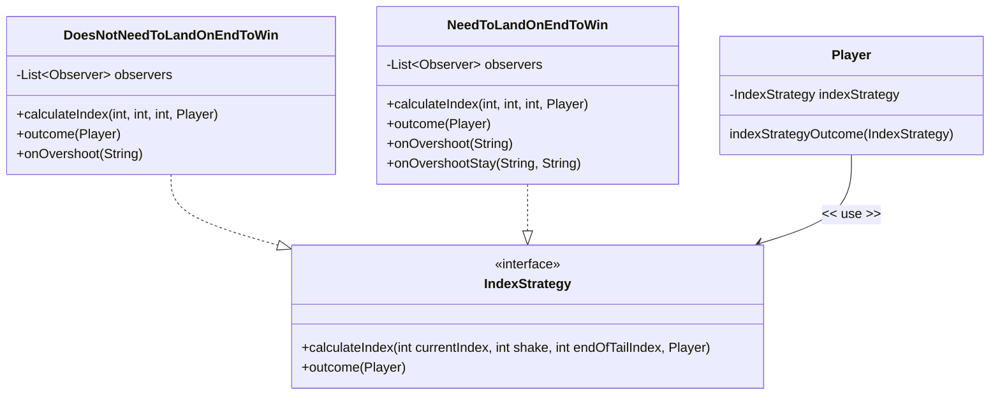
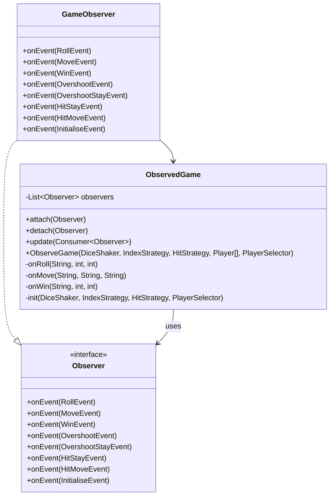

# Software Design And Architecture - Frustration Game

## Dice Variation

Using the lab, different Dice Shakers were implemented with decorators and abstract factories. For the purpose of demonstrating the variations work and whilst testing, a fixed set of dice rolls were used with the NonRandomDiceShaker class. The RandomObserveGame takes a parameter of DiceShakerFactory for random shakes of either a Single or Double.

## Strategy pattern for hit and win conditions

To implement the other functional variations, the strategy pattern was used for the win and hit conditions. The algorithm on the next decision if a player is hit or overshoots the end is the thing that is varying. Hence it is extracted from the main game code, and each different outcome is encapsulated in its own class with a common interface. This pattern supports the Open/Closed principle (OCP) as it allows extension, in this case another variation, by writing a new implementation of the IndexStrategy or HitStrategy interface without changing the original code and supplying that concrete class at runtime. 

## Hit Condition
For the hit conditions, the function “move” to check if another player has been hit is the same. After checking that the player is not moving beyond the start of the tail, a loop checks through all the other players and if another player occupies the position the current player would land on, that player’s number is return instead of the current player. If the player collided with another player, the “outcome” method contains the difference between advancing or staying whilst still updating the observer the event.

## Win Conditions

If there is no collision, the player advances with the index strategy.For the “DoesNotNeedToLandOnEndToWin” condition, if a player overshoots the message is sent to the console and their current index is set end of tail to satisfy that the player is at the end for the game to end. For the “NeedToLandOnEndToWin” condition, the current index is set back to before the roll was added if the player overshoots. Then in the main game, the position will be the same as the start, therefore calling “indexStrategyOutcome” with the message output to say the player overshoots but remains in the same place. Otherwise, observers are notified with “onMove”.

##	Advanced Feature - Large Board with 4 players

Once again the strategy pattern was used to determine which player has a turn with the PlayerSelector interface. It is then wrapped in an iterator for a game loop. This makes switching between a two and four player game easier and could handle more players added in future.  I have made a PlayerList to be able to track a current players positions which is required for hit detection. 

## Observers to Separate Infrastructure Code

For the game the User Interface (CLI) is the infrastructure (technologies needed to make a complete software product). In order to write in a clean architecture style, the observer pattern will be used to separate the infrastructure code from the application code. ObservedGame focuses only on game rules and flow by creating an event object when something happens, notifying all observers by calling the update function and pushing that data as a payload. GameObserver handles console output as a concrete implementation of the observer interface. Adding observers is a way of making a class closed for modification and open for extensibility as the ObservedGame does not need to change when new behaviour or output is needed and new observers can be added to react to events. 

## Clean Architecture with Ports and Adaptors

I have attempted to write in a clean architecture style using ports and adaptors. I have created a required interface for each variation parameter. The provided interface uses these and UseCase implements the provided interface to play the game. The GameConfig package contains all the example outputs. I have attempted to do dependency inversion principle through this architecture as the application code defines its own interfaces with the infrastructure code depending on these interfaces instead. 

## Evaluation

Overall, I think my implementation is definitely a starting point. My favourite design pattern is clearly the Strategy pattern since it’s so versatile and is similar to other patterns I have learnt about I this module. I would like to improve by using more patterns wherever I can (I did not do as many as I’d hope).  For example, I have started the state machine but did not have the chance to implement it properly. A major reason for these patterns is to be able to write more maintainable code and for the product to be extensible. For the dice, hit and win variations I believe this is possible, and maybe addition players too. However, I don’t think my current game would be able to do other variations than the functional ones given without having to change my main game code. 
